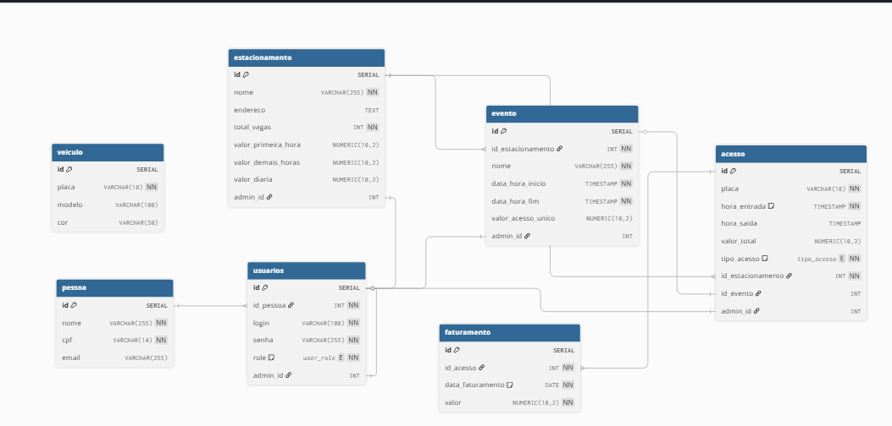

# TPPE_Estacionamento

Sistema de gerenciamento de estacionamento com API em FastAPI, banco de dados PostgreSQL e interface web em React.

## Repositório anterior
[Trabalho de OO](https://github.com/ItaloBrunoM/OO_trabalho)

---

## Diagrama UML de classe do projeto

<div align='center'>
<p>Diagrama UML de Classes:</p>
</img>
</div>

## Diagrama Fisico do banco de dados

<div align='center'>
<p>Diagrama UML de Classes:</p>
</img>
</div>

## Requisitos

- [Docker](https://www.docker.com/)
- [Docker Compose](https://docs.docker.com/compose/)

---

## Como executar o projeto

1. **Clone o repositório**  
   ```bash
   git clone https://github.com/SeuUsuario/TPPE_Estacionamento.git
   cd TPPE_Estacionamento

2. **Construa e inicie os containers**

    ```bash
    docker-compose up --build

3. **Acesse a aplicação:**

* Frontend: http://localhost:3000
* Backend (API): http://localhost:8000
